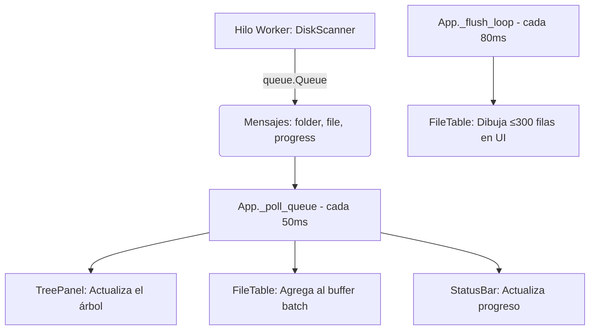

# Disk Analyzer (DKA)

[](https://www.python.org/downloads/)
[](#licencia)
[]()

Un analizador de espacio en disco con interfaz gráfica (GUI) rápido y ligero para Windows. Construido íntegramente con Python y `tkinter`, te permite descubrir rápidamente qué archivos y carpetas están consumiendo el almacenamiento de tu disco.

---

## Características Principales

- **Escaneo Multihilo Rápido:** Utiliza `ThreadPoolExecutor` para escanear directorios en paralelo y mostrar resultados en tiempo real.
- **Visualización en Árbol y Tabla:** Explora tu disco mediante una vista jerárquica de carpetas y una tabla detallada de archivos.
- **Filtrado Dinámico:** Filtra instantáneamente por:
  - **Tipo de archivo:** Videos, Imágenes, Audio, Documentos, Archivos Comprimidos, etc.
  - **Tamaño:** >1 MB, >100 MB, >1 GB, etc.
  - **Nombre:** Búsqueda en tiempo real (insensible a mayúsculas).
- **Gestión de Archivos:** Envía archivos a la Papelera de Reciclaje (con soporte de fallback) o elimínalos permanentemente desde la app.
- **Sin Dependencias Pesadas:** Solo utiliza módulos de la biblioteca estándar de Python (con soporte opcional de `pywin32` para la Papelera).
- **Detección de Duplicados:** Encuentra y gestiona archivos duplicados para liberar aún más espacio.

---

## Capturas de Pantalla

*(Añade aquí un par de capturas de pantalla de tu aplicación funcionando)*
<!-- 

 
-->

---

## Requisitos

- **Sistema Operativo:** Windows 10 / 11
- **Python:** 3.10 o superior 

> **Nota sobre pywin32:** Se utiliza para operaciones nativas de la Papelera de reciclaje mediante la API de Windows. Si no está instalado o disponible, la aplicación utiliza un fallback automático vía `ctypes`.

---

## Instalación y Uso

1. Clona este repositorio o descarga el código fuente:
   ```bash
   git clone https://github.com/tu-usuario/disk_analyzer.git
   cd disk_analyzer
   ```

2. Ejecuta la aplicación de escritorio:
   ```bash
   python main.py
   ```

---

## Estructura del Proyecto

El código está organizado de forma modular para separar la interfaz gráfica de la lógica de escaneo.

```text
disk_analyzer/
├── main.py              # Punto de entrada de la aplicación
├── app.py               # Clase principal App (lógica de orquestación)
├── core/                # Lógica de negocio y motor de escaneo
│   ├── models.py        # Clases de datos: FileEntry, FolderNode, ScanResult
│   ├── scanner.py       # Motor de escaneo paralelo
│   └── trash.py         # Operaciones seguras de Papelera y borrado
├── ui/                  # Componentes de la Interfaz Gráfica (tkinter)
│   ├── toolbar.py       # Barra superior de navegación y controles
│   ├── disk_bar.py      # Barra de progreso visual del uso del disco
│   ├── tree_panel.py    # Panel izquierdo (Árbol jerárquico)
│   ├── file_table.py    # Panel derecho (Tabla de archivos)
│   ├── filter_bar.py    # Barra de filtros (tipo, tamaño, búsqueda)
│   ├── status_bar.py    # Barra inferior con métricas y progreso
│   └── dialogs.py       # Ventanas modales (duplicados, confirmaciones)
└── utils/               # Utilidades y ayuda
    └── formatters.py    # Formateo de bytes y porcentajes
```

---

## Arquitectura de Escaneo en Tiempo Real

La aplicación separa completamente el escaneo de archivos (Hilo Worker) de la Interfaz Gráfica (Hilo Principal) para evitar que la aplicación se congele.



### Tipos de Mensajes del Escáner

| Tipo de Mensaje | Campos Clave Contenidos |
|-----------------|-------------------------|
| `start` | `root`, `n_top` |
| `folder` | `path`, `parent`, `size`, `file_count` |
| `file` | `path`, `name`, `size`, `category`, `extension`, `is_cache` |
| `progress` | `done`, `total`, `current`, `bytes` |
| `done` | `total_bytes`, `elapsed`, `duplicates` |
| `error` | `path`, `msg` |

---

## Accesos Directos y Acciones UI

La aplicación soporta navegación fluida por teclado y menús contextuales:

| Acción | Atajo / Interacción |
|--------|---------------------|
| **Abrir en Explorador** | Doble click en el archivo |
| **Mover a Papelera** | Tecla `Suprimir` (`Delete`) |
| **Eliminar Permanente** | Clic derecho > Menú contextual |
| **Copiar Ruta** | `Ctrl + C` |
| **Nuevo Escaneo** | `F5` o Botón de Refrescar |
| **Explorar Subcarpetas** | Clic izquierdo en carpeta del árbol |

---

## Contribuir

¡Las contribuciones son bienvenidas! Si deseas mejorar este proyecto:

1. Haz un *Fork* del repositorio.
2. Crea una rama para tu característica (`git checkout -b feature/NuevaCaracteristica`).
3. Haz *Commit* de tus cambios (`git commit -m 'Añade una nueva característica'`).
4. Haz *Push* a la rama (`git push origin feature/NuevaCaracteristica`).
5. Abre un **Pull Request**.

Si encuentras algún error o tienes sugerencias, por favor abre un _Issue_ en este repositorio.

---

## Licencia

Este proyecto se distribuye bajo una **Licencia Gratuita y No Comercial**. 

- ✔️ **Puedes:** Usar la herramienta libremente, ver el código, editarlo y compartir tus propias mejoras con la comunidad.
- ❌ **No puedes:** Vender este software, distribuirlo cobrando dinero, ocultarlo tras muros de pago o integrarlo en productos comerciales bajo ninguna circunstancia. Cualquier versión modificada **tiene obligatoriamente que seguir siendo gratuita**.
- ⚠️ **Obligatorio:** Siempre debes mantener el aviso de derechos de autor original (`Copyright (c) Lizzen`) y dar el crédito correspondiente si distribuyes o modificas el código.

Consulta el archivo `LICENSE` para leer los términos completos.
| Color      | Significado      |
|------------|------------------|
| Rojo       | > 1 GB           |
| Naranja    | > 100 MB         |
| Amarillo   | > 10 MB          |
| Gris       | Archivo de caché |

## Seguridad

- **Borrado permanente protegido**: Rechaza automáticamente rutas críticas del sistema (`C:\`, `C:\Windows`, `C:\Windows\System32`, `C:\Users`, `C:\Program Files`, `C:\Program Files (x86)`).
- **Sin shell=True**: Los comandos de subprocess usan listas de argumentos, previniendo inyección de comandos.
- **Mover a Papelera primero**: La acción por defecto envía a la Papelera (recuperable). El borrado permanente requiere confirmación explícita separada.
- **Hilos daemon**: Los threads del scanner son `daemon=True`, garantizando que el proceso Python termina correctamente al cerrar la ventana.

## Categorías de archivos detectadas

| Categoría               | Extensiones ejemplo                      |
|-------------------------|------------------------------------------|
| Videos                  | .mp4, .mkv, .avi, .mov, .wmv            |
| Imágenes                | .jpg, .png, .gif, .raw, .psd            |
| Audio                   | .mp3, .flac, .wav, .aac                 |
| Documentos              | .pdf, .docx, .xlsx, .txt                |
| Instaladores/ISO        | .iso, .exe, .msi, .zip, .7z, .rar      |
| Temporales/Cache        | .tmp, .temp, .log, .bak, .dmp          |
| Desarrollo (compilados) | .pyc, .class, .obj, .pdb               |
| Bases de datos          | .db, .sqlite, .mdf                      |

## Duplicados

Se detectan automáticamente archivos con el **mismo nombre Y mismo tamaño** mayores de 1 MB. Ver el informe completo desde **Ver → Mostrar duplicados** tras completar un escaneo.

---

Basado en [analyzer.py](../analyzer.py) — versión de terminal original.
