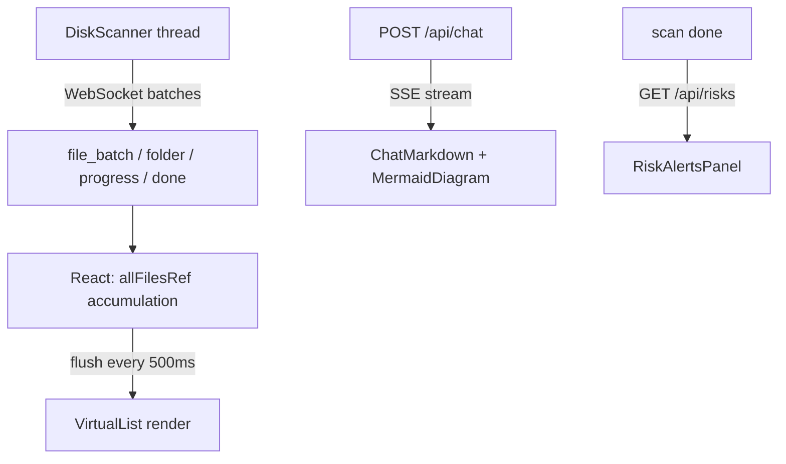
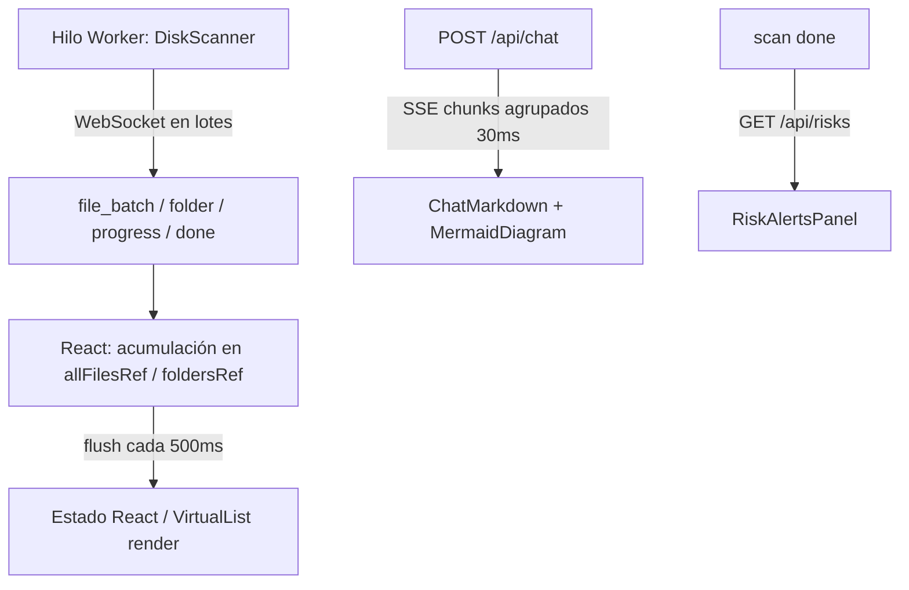

# Disk Analyzer (DKA)

[English](#english) | [Español](#español)

---

<a id="english"></a>
# Disk Analyzer (DKA) — English

[]()
[](https://www.python.org/downloads/)
[](#license)
[]()

A fast, modern disk space analyzer for Windows with an **integrated AI Assistant**. Scan your drive in seconds, visualize what is consuming your storage, and ask an AI chatbot what to do next — all from a sleek dark interface.

---

## ⬇️ Download

> **No Python or Node.js required — just download and run.**

**[⬇ Download DiskAnalyzer.exe (v1.0.1)](https://github.com/Lizzen/disk_analyzer/releases/latest/download/DiskAnalyzer.exe)**

Or go to the [Releases page](https://github.com/Lizzen/disk_analyzer/releases/latest) to see all versions.

> Windows will request administrator privileges on launch — this is required to scan all disk folders accurately.

---

## Key Features

### Scanning & Analysis
- **Fast Multithreaded Scanning** — `os.scandir()` DFS with `ThreadPoolExecutor`, real-time results streamed as it scans.
- **Heavy Folder Detection** — `node_modules`, `.git`, `__pycache__`, `venv`, `ShaderCache` etc. reported with total size during scan without full indexing.
- **MD5 Duplicate Detection** — Same name + size → verified by MD5 hash in background.
- **Risk Alerts** — Automatic post-scan analysis surfaces dangerous or wasteful files: executables in TEMP, large no-extension files, abnormal folder sizes, duplicate waste over 500 MB.
- **Scan History** — Last 10 scans persisted locally for quick comparison.

### Visualization & Navigation
- **Virtualized File Table** — Custom virtualizer renders only visible rows — handles 1M+ files smoothly.
- **Multiple Views** — Folder tree, sortable file table, horizontal bar chart, treemap, timeline.
- **Dynamic Filtering** — Category pills, minimum size selector, debounced name search, last-accessed filter (6 months / 1 year / 2 years).
- **Favorites & Comparator** — Pin frequently scanned paths, compare two folders side-by-side.

### File Management
- **Context Menu** — Right-click to open in Explorer, copy path, attach to AI chat, move to Recycle Bin, or permanently delete.
- **Temp Cleaner** — Targeted cleanup of Chrome/Edge/Firefox caches, Windows temp folders and thumbnails.
- **Export** — CSV, JSON, or standalone HTML report with CSS charts and full tables.

### UI & Themes
- **12 Visual Themes** — Dark Void, Midnight Blue, Forest Dark, Light Vanilla, Profile Neon, Profile Pastel, Dark Premium, Dracula, Nord, Tokyo Night, Catppuccin Mocha, GitHub Dark — switchable live from Settings.
- **Toast Notifications** — Subtle slide-in toasts confirm scan completion, clipboard actions, and more.

### AI Assistant
- **Integrated Chatbot** — Streaming chat with full access to scan metadata.
- **Mermaid Diagram Generation** — The AI can render interactive flowcharts, architecture maps, and folder structure diagrams directly in the chat.
- **Multimodal Input** — Attach images (PNG/JPEG/WebP, max 5 MB) to chat messages.
- **40+ Models** — Across Gemini (10), Groq (25+), Claude (11) with search and tag filters.
- **Built-in Docs** — Expandable guides in Settings covering how to use the app and configure API keys.

---

## AI Assistant

The right panel includes a chatbot with access to your scan results. Ask it things like:

- *"What is taking up the most space?"*
- *"Is it safe to delete these cache files?"*
- *"Which duplicates should I remove?"*
- *"Show me the folder structure as a diagram."*
- *"Draw a flowchart of how the scanner works."*

Right-click any file and select **Attach to chat** to give the AI specific context about it.

### Supported Providers

| Provider | Models | Free Tier | Requires Key |
|---|---|---|---|
| **Google Gemini** | gemini-2.5-flash/pro, gemini-2.0-flash, gemini-1.5-pro/flash… | ✓ 1,500 req/day | Yes — [aistudio.google.com](https://aistudio.google.com/app/apikey) |
| **Groq** | Llama 4 Scout, Llama 3.3 70B, Kimi K2, Qwen 3 32B, DeepSeek R1… | ✓ 14,400 req/day | Yes — [console.groq.com](https://console.groq.com/keys) |
| **Claude (Anthropic)** | claude-haiku-4-5, claude-sonnet-4-5/4-6, claude-opus-4-6… | Trial credits | Yes — [console.anthropic.com](https://console.anthropic.com/account/keys) |
| **Ollama (local)** | Auto-detected from your local installation | ✓ Unlimited | No — requires [Ollama](https://ollama.com) |

### Setup

1. Open the **⚙ settings** panel in the chat header.
2. Go to the **🔑 Keys** tab — enter your API key for the desired provider.
3. Go to the **🤖 Models** tab — select a model from the list (search or filter by tag). For Ollama, press **↺ detect** to auto-fetch installed models.
4. Press the **Test** button on each key card to send a real minimal call and verify the connection.
5. Press **Save** — keys are stored in `%APPDATA%\DiskAnalyzer\api_keys.json`, outside the repository.

---

## Screenshots

*(Add screenshots here)*

---

## Running from Source

Requirements: **Windows 10/11**, **Python 3.11+**, **Node.js 18+**

```bash
git clone https://github.com/Lizzen/disk_analyzer.git
cd disk_analyzer

# Install Python dependencies
pip install -r requirements.txt

# Build frontend (only needed once, or after frontend changes)
cd frontend && npm install && npm run build && cd ..

# Launch (double-click or run from terminal)
.\run_admin.bat
```

### Building the executable yourself

```bash
.\build_exe.bat
# Output: dist\DiskAnalyzer.exe
```

---

## Project Structure

```text
disk_analyzer/
├── app_web.py              # Main entry point (FastAPI + pywebview)
├── api.py                  # FastAPI backend: WebSocket scan, chat SSE, export, risks, temp cleaner
├── disk_analyzer.spec      # PyInstaller build config (onefile)
├── build_exe.bat           # One-click build script
├── run_admin.bat           # Development launcher
├── requirements.txt        # Pinned Python dependencies
├── core/
│   ├── models.py           # Data classes: FileEntry, FolderNode, ScanResult
│   ├── scanner.py          # DFS scanner, heavy folder detection, MD5 duplicate verification
│   ├── risk_detector.py    # Post-scan risk analysis
│   └── trash.py            # Recycle Bin, safe permanent delete, symlink guard
├── chatbot/
│   ├── config.py           # API key storage (Windows Credential Manager) and model config
│   ├── context_builder.py  # Builds system prompt from scan metadata + glossary
│   └── providers/
│       ├── base.py         # Abstract AIProvider base class
│       ├── gemini.py       # Google Gemini
│       ├── groq_p.py       # Groq
│       ├── claude.py       # Anthropic Claude
│       └── ollama.py       # Ollama local
├── frontend/
│   ├── src/
│   │   ├── App.jsx                         # Main component
│   │   ├── components/chat/                # ChatMarkdown, Mermaid, action bar
│   │   ├── components/files/               # Virtualized file table
│   │   ├── components/modals/              # Settings, temp cleaner, risk alerts
│   │   └── components/visualizations/      # Treemap, timeline, bar chart
│   └── dist/               # Pre-built production assets (served by FastAPI)
├── utils/
│   ├── formatters.py       # Byte and percentage formatting
│   └── logger.py           # Rotating file logger
└── tests/
    ├── test_scanner.py     # Scanner unit tests
    └── test_api.py         # 43 API endpoint integration tests
```

---

## Architecture



### WebSocket Message Types

| Type | Fields |
|---|---|
| `start` | `root` |
| `folder` | `path`, `size`, `file_count` |
| `file_batch` | `entries: list[dict]` |
| `progress` | `done`, `total`, `current`, `bytes` |
| `heavy_folder` | `path`, `name`, `parent`, `size` |
| `done` | `total_bytes`, `elapsed`, `duplicates`, `errors` |

### API Endpoints

| Method | Path | Description |
|---|---|---|
| `WS` | `/ws/scan` | Real-time scan messages |
| `GET` | `/api/drives` | List available drives |
| `GET` | `/api/disk-info` | Disk usage for a given path |
| `POST` | `/api/chat` | SSE streaming AI chat |
| `GET` | `/api/config` | Load saved config (keys masked) |
| `POST` | `/api/config` | Save API keys and model names |
| `GET` | `/api/providers/status` | Check availability of all providers |
| `POST` | `/api/providers/test` | Send a real minimal call to a provider and return its response |
| `GET` | `/api/ollama/models` | List locally installed Ollama models |
| `POST` | `/api/export` | Export scan as CSV, JSON, or HTML |
| `GET` | `/api/risks` | Post-scan risk analysis |
| `GET` | `/api/temp-files` | Scan temp/cache directories |
| `POST` | `/api/temp-clean` | Delete selected temp files |
| `POST` | `/api/open-in-explorer` | Open a path in Windows Explorer |
| `POST` | `/api/trash` | Move file to Recycle Bin |
| `POST` | `/api/delete-permanent` | Permanently delete file (with system path guard) |

---

## Security & Privacy

- **Secure credential storage** — API keys stored in the Windows Credential Manager, never in plain text files.
- **Symlink traversal guard** — Recycle Bin and permanent delete check resolved symlink targets against protected paths.
- **Protected permanent deletion** — Rejects critical system paths (`C:\`, `C:\Windows`, `C:\System32`, etc.) and their ancestors.
- **Temp cleaner path validation** — Every path validated against known temp roots before deletion.
- **No `shell=True`** — Subprocesses use argument lists — no command injection risk.
- **Input validation** — All API endpoints validate path lengths, characters, and drive letters.
- **AI sees metadata only** — The chatbot receives names, sizes, paths and categories. It never reads file contents.
- **XSS-safe Mermaid** — `securityLevel: "strict"` + DOM rendering instead of `innerHTML` injection.
- **HTML export XSS-safe** — All values escaped with `html.escape()`.
- **CORS restricted** — API only accepts requests from `localhost` / `127.0.0.1`.

---

## License

**Free and Non-Commercial License.**

- **Allowed:** Use, view, modify, and share improvements freely.
- **Forbidden:** Sell, charge for distribution, or integrate into commercial products.
- **Required:** Keep the copyright notice (`Copyright (c) Lizzen`) on any distributed or modified version.

See the `LICENSE` file for full terms.

---
---

<a id="español"></a>
# Disk Analyzer (DKA) — Español

[]()
[](https://www.python.org/downloads/)
[](#licencia)
[]()

Analizador de espacio en disco moderno para Windows con **Asistente de IA integrado**. Escanea tu disco en segundos, visualiza qué consume tu almacenamiento y pregunta al chatbot qué hacer — todo desde una interfaz oscura y fluida.

---

## ⬇️ Descarga

> **No requiere Python ni Node.js — descarga y ejecuta directamente.**

**[⬇ Descargar DiskAnalyzer.exe (v1.0.1)](https://github.com/Lizzen/disk_analyzer/releases/latest/download/DiskAnalyzer.exe)**

O visita la [página de Releases](https://github.com/Lizzen/disk_analyzer/releases/latest) para ver todas las versiones.

> Windows pedirá permisos de administrador al lanzar la app — necesario para escanear todas las carpetas del disco con precisión.

---

## Características Principales

### Escaneo y Análisis
- **Escaneo Multihilo Rápido** — DFS con `os.scandir()` y `ThreadPoolExecutor`, resultados en tiempo real.
- **Detección de Carpetas Pesadas** — `node_modules`, `.git`, `__pycache__`, `venv`, `ShaderCache` etc. reportados con tamaño total sin indexación completa.
- **Detección de Duplicados MD5** — Mismo nombre + tamaño → verificado por hash MD5 en segundo plano.
- **Alertas de Riesgo** — Análisis automático post-escaneo: ejecutables en TEMP, archivos grandes sin extensión, carpetas anómalamente grandes, duplicados que desperdician más de 500 MB.
- **Historial de Escaneos** — Últimos 10 escaneos persistidos localmente para comparación rápida.

### Visualización y Navegación
- **Tabla Virtualizada** — Virtualizador propio — fluido con más de 1M de archivos.
- **Múltiples Vistas** — Árbol de carpetas, tabla de archivos, gráfica de barras, treemap, línea de tiempo.
- **Filtrado Dinámico** — Pills de categoría, selector de tamaño mínimo, búsqueda por nombre, filtro por último acceso (6 meses / 1 año / 2 años).
- **Favoritos y Comparador** — Fija rutas frecuentes y compara dos carpetas lado a lado.

### Gestión de Archivos
- **Menú Contextual** — Clic derecho para abrir en Explorador, copiar ruta, adjuntar al chat, Papelera o borrado permanente.
- **Limpiador de Temporales** — Limpieza selectiva de cachés de Chrome/Edge/Firefox, carpetas temp de Windows y miniaturas.
- **Exportación** — CSV, JSON o informe HTML independiente con gráficas CSS y tablas completas.

### Interfaz y Temas
- **12 Temas Visuales** — Dark Void, Midnight Blue, Forest Dark, Light Vanilla, Profile Neon, Profile Pastel, Dark Premium, Dracula, Nord, Tokyo Night, Catppuccin Mocha, GitHub Dark — cambiables en vivo desde Ajustes.
- **Notificaciones Toast** — Toasts discretos confirman el fin del escaneo, acciones de portapapeles y más.

### Asistente IA
- **Chatbot Integrado** — Chat con streaming y acceso completo a los metadatos del escaneo.
- **Generación de Diagramas Mermaid** — La IA puede renderizar flowcharts, mapas de arquitectura y diagramas de estructura directamente en el chat.
- **Entrada Multimodal** — Adjunta imágenes (PNG/JPEG/WebP, máx. 5 MB) a los mensajes.
- **Más de 40 Modelos** — Entre Gemini (10), Groq (25+), Claude (11) con búsqueda y filtros por etiqueta.
- **Documentación Integrada** — Guías expandibles en Ajustes sobre cómo usar la app y configurar claves de API.

---

## Asistente IA

El panel derecho incluye un chatbot con acceso a los resultados de tu escaneo:

- *"¿Qué está ocupando más espacio?"*
- *"¿Puedo borrar los archivos de caché de forma segura?"*
- *"¿Cuáles de estos duplicados debo eliminar?"*
- *"Muéstrame la estructura de carpetas como diagrama."*
- *"Dibuja un flowchart de cómo funciona el scanner."*

Haz clic derecho en cualquier archivo y selecciona **Adjuntar al chat** para darle contexto específico a la IA.

### Proveedores Soportados

| Proveedor | Modelos | Tier gratuito | Requiere key |
|---|---|---|---|
| **Google Gemini** | gemini-2.5-flash/pro, gemini-2.0-flash, gemini-1.5-pro/flash… | ✓ 1.500 req/día | Sí — [aistudio.google.com](https://aistudio.google.com/app/apikey) |
| **Groq** | Llama 4 Scout, Llama 3.3 70B, Kimi K2, Qwen 3 32B, DeepSeek R1… | ✓ 14.400 req/día | Sí — [console.groq.com](https://console.groq.com/keys) |
| **Claude (Anthropic)** | claude-haiku-4-5, claude-sonnet-4-5/4-6, claude-opus-4-6… | Créditos trial | Sí — [console.anthropic.com](https://console.anthropic.com/account/keys) |
| **Ollama (local)** | Detectado automáticamente | ✓ Sin límite | No — requiere [Ollama](https://ollama.com) |

### Configurar la IA

1. Abre el panel **⚙ configuración** en la cabecera del chat.
2. Pestaña **🔑 Keys** — introduce tu API key del proveedor deseado.
3. Pestaña **🤖 Modelos** — selecciona un modelo de la lista (busca o filtra por etiqueta). Para Ollama, pulsa **↺ detectar** para cargar los modelos instalados.
4. Pulsa el botón **Probar** en la tarjeta de cada key para hacer una llamada real mínima y verificar la conexión.
5. Pulsa **Guardar** — se guarda en `%APPDATA%\DiskAnalyzer\api_keys.json`, fuera del repositorio.

---

## Capturas de Pantalla

*(Añade aquí capturas de la aplicación)*

---

## Ejecutar desde el código fuente

Requisitos: **Windows 10/11**, **Python 3.11+**, **Node.js 18+**

```bash
git clone https://github.com/Lizzen/disk_analyzer.git
cd disk_analyzer

# Instalar dependencias Python
pip install -r requirements.txt

# Compilar frontend (solo una vez, o tras cambios en el frontend)
cd frontend && npm install && npm run build && cd ..

# Lanzar (doble clic o desde terminal)
.\run_admin.bat
```

### Compilar el ejecutable

```bash
.\build_exe.bat
# Resultado: dist\DiskAnalyzer.exe
```

---

## Estructura del Proyecto

```text
disk_analyzer/
├── app_web.py              # Punto de entrada principal (FastAPI + pywebview)
├── api.py                  # Backend FastAPI: WebSocket scan, chat SSE, export, riesgos, limpiador temp
├── disk_analyzer.spec      # Configuración de compilación PyInstaller (onefile)
├── build_exe.bat           # Script de compilación con un clic
├── run_admin.bat           # Lanzador de desarrollo
├── requirements.txt        # Dependencias Python con versiones fijadas
├── core/
│   ├── models.py           # Clases de datos: FileEntry, FolderNode, ScanResult
│   ├── scanner.py          # Scanner DFS, detección carpetas pesadas, duplicados MD5
│   ├── risk_detector.py    # Análisis de riesgos post-escaneo
│   └── trash.py            # Papelera, borrado permanente, guardia de symlinks
├── chatbot/
│   ├── config.py           # API keys (Administrador de Credenciales) y config de modelos
│   ├── context_builder.py  # Construye el system prompt desde metadatos del escaneo
│   └── providers/
│       ├── base.py         # Clase base abstracta AIProvider
│       ├── gemini.py       # Google Gemini
│       ├── groq_p.py       # Groq
│       ├── claude.py       # Anthropic Claude
│       └── ollama.py       # Ollama local
├── frontend/
│   ├── src/
│   │   ├── App.jsx                         # Componente principal
│   │   ├── components/chat/                # ChatMarkdown, Mermaid, barra de acciones
│   │   ├── components/files/               # Tabla de archivos virtualizada
│   │   ├── components/modals/              # Ajustes, limpiador temp, alertas de riesgo
│   │   └── components/visualizations/      # Treemap, línea de tiempo, gráfica de barras
│   └── dist/               # Assets de producción pre-compilados (servidos por FastAPI)
├── utils/
│   ├── formatters.py       # Formateo de bytes y porcentajes
│   └── logger.py           # Logger con rotación de archivos
└── tests/
    ├── test_scanner.py     # Tests unitarios del scanner
    └── test_api.py         # 43 tests de integración de endpoints API
```

---

## Arquitectura



### Tipos de Mensajes WebSocket

| Tipo | Campos |
|---|---|
| `start` | `root` |
| `folder` | `path`, `size`, `file_count` |
| `file_batch` | `entries: list[dict]` |
| `progress` | `done`, `total`, `current`, `bytes` |
| `heavy_folder` | `path`, `name`, `parent`, `size` |
| `done` | `total_bytes`, `elapsed`, `duplicates`, `errors` |

### Endpoints de la API

| Método | Ruta | Descripción |
|---|---|---|
| `WS` | `/ws/scan` | Mensajes de escaneo en tiempo real |
| `GET` | `/api/drives` | Lista las unidades disponibles |
| `GET` | `/api/disk-info` | Uso de disco para una ruta dada |
| `POST` | `/api/chat` | Chat con IA vía SSE streaming |
| `GET` | `/api/config` | Carga configuración guardada (keys enmascaradas) |
| `POST` | `/api/config` | Guarda API keys y nombres de modelos |
| `GET` | `/api/providers/status` | Comprueba disponibilidad de todos los proveedores |
| `POST` | `/api/providers/test` | Hace una llamada real mínima a un proveedor y devuelve su respuesta |
| `GET` | `/api/ollama/models` | Lista los modelos Ollama instalados localmente |
| `POST` | `/api/export` | Exporta el escaneo como CSV, JSON o HTML |
| `GET` | `/api/risks` | Análisis de riesgos post-escaneo |
| `GET` | `/api/temp-files` | Escanea directorios temporales/caché |
| `POST` | `/api/temp-clean` | Elimina archivos temporales seleccionados |
| `POST` | `/api/open-in-explorer` | Abre una ruta en el Explorador de Windows |
| `POST` | `/api/trash` | Mueve un archivo a la Papelera de reciclaje |
| `POST` | `/api/delete-permanent` | Elimina permanentemente (con protección de rutas del sistema) |

---

## Código de Colores en la Tabla

| Color | Significado |
|---|---|
| Rojo | > 1 GB |
| Naranja | > 100 MB |
| Azul | > 10 MB |
| Morado | Archivo de caché / temporal |
| Alternado oscuro | Resto de archivos |

---

## Categorías de Archivos Detectadas

| Categoría | Extensiones |
|---|---|
| Videos | `.mp4`, `.mkv`, `.avi`, `.mov`, `.wmv`, `.ts`… |
| Imágenes | `.jpg`, `.png`, `.gif`, `.raw`, `.psd`, `.heic`… |
| Audio | `.mp3`, `.flac`, `.wav`, `.aac`, `.opus`… |
| Documentos | `.pdf`, `.docx`, `.xlsx`, `.txt`, `.epub`… |
| Instaladores/ISO | `.iso`, `.exe`, `.msi`, `.zip`, `.7z`, `.rar`… |
| Temporales/Cache | `.tmp`, `.temp`, `.log`, `.bak`, `.dmp`… |
| Desarrollo (compilados) | `.pyc`, `.class`, `.obj`, `.pdb`… |
| Bases de datos | `.db`, `.sqlite`, `.mdf`… |

---

## Seguridad y Privacidad

- **Almacenamiento seguro de credenciales** — API keys en el Administrador de Credenciales de Windows, nunca en texto plano.
- **Guardia contra traversal por symlinks** — Papelera y borrado verifican el destino real de los enlaces simbólicos.
- **Borrado permanente protegido** — Rechaza rutas críticas del sistema (`C:\`, `C:\Windows`, etc.) y sus ancestros.
- **Validación de rutas en el limpiador** — Cada ruta se valida contra raíces temp conocidas antes de borrar.
- **Sin `shell=True`** — Los subprocesos usan listas de argumentos — sin riesgo de inyección de comandos.
- **Validación de entrada** — Todos los endpoints validan longitud de ruta, caracteres y letras de unidad.
- **La IA solo ve metadatos** — El chatbot recibe nombres, tamaños, rutas y categorías. Nunca lee contenidos de archivos.
- **Mermaid XSS-safe** — `securityLevel: "strict"` + renderizado DOM en lugar de inyección de `innerHTML`.
- **Exportación HTML XSS-safe** — Todos los valores escapados con `html.escape()`.
- **CORS restringido** — La API solo acepta peticiones desde `localhost` / `127.0.0.1`.

---

## Licencia

**Licencia Libre y No Comercial.**

- **Permitido:** Usar, ver, modificar y compartir mejoras libremente.
- **Prohibido:** Vender, cobrar por distribución o integrar en productos comerciales.
- **Obligatorio:** Mantener el aviso de copyright (`Copyright (c) Lizzen`) en cualquier versión distribuida o modificada.

Ver el archivo `LICENSE` para los términos completos.
