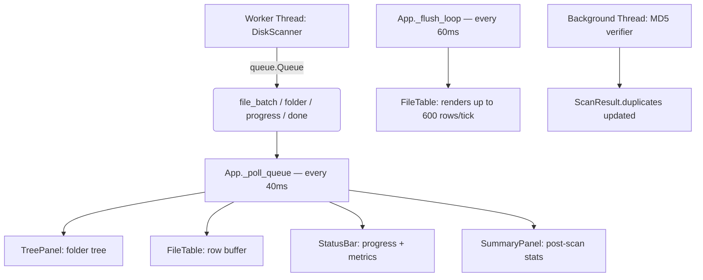
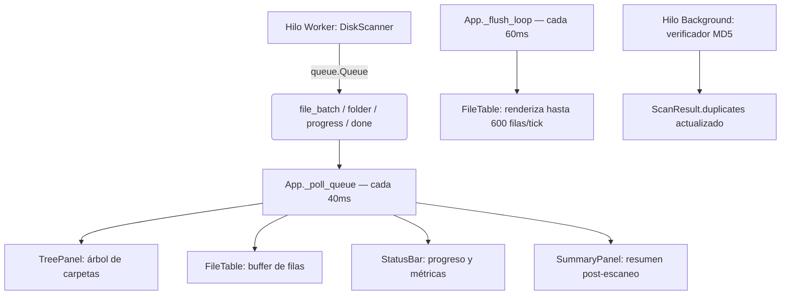

# Disk Analyzer (DKA)

[English](#english) | [Español](#español)

---

<a id="english"></a>
# Disk Analyzer (DKA) - English

[](https://www.python.org/downloads/)
[]()
[](#license)
[]()

A fast, modern disk space analyzer for Windows with an **integrated AI Assistant**. Built entirely with Python and `tkinter`, it lets you discover which files and folders are consuming your storage, clean them up safely, and ask an AI what to do next.

---

## Key Features

- **Fast Multithreaded Scanning:** `os.scandir()` DFS with `ThreadPoolExecutor` — real-time results as it scans.
- **Modern Dark UI:** Premium dark theme inspired by Linear, Arc and Raycast — hover animations, pill filters, donut disk chart.
- **Post-scan Summary Panel:** Stat cards (files, folders, total size, duplicates) + top categories bar chart after every scan.
- **Tree and Table Views:** Hierarchical folder tree and sortable file table with row color coding by size.
- **Dynamic Filtering:** Category pills, minimum size selector, and real-time name search.
- **MD5 Duplicate Detection:** Finds files with the same name and size, then verifies them by MD5 hash in the background.
- **File Management:** Send to Recycle Bin or permanently delete — with protected system path checks.
- **Excluded Folders:** Skip heavy directories from scanning (e.g. `node_modules`, `Xilinx`) — persisted across sessions.
- **Scan Logging:** Rotating log files in `logs/` for diagnosing scan issues (`DKA_DEBUG=1` enables console output).
- **Integrated AI Assistant:** Side chat panel supporting 4 providers — context-aware, with full access to scan metadata.
- **Tooltips:** Hover over toolbar buttons for instant contextual hints.

---

## AI Assistant

The right panel includes a chatbot with access to your scan results. Ask it things like:

- *"What is taking up the most space?"*
- *"Is it safe to delete these cache files?"*
- *"Which duplicates should I remove?"*
- *"Summarise what this scan found."*

### Supported Providers

| Provider | Default Model | Free Tier | Requires Key |
|---|---|---|---|
| **Google Gemini** | gemini-2.0-flash-lite | ✓ 1,500 req/day | Yes — [aistudio.google.com](https://aistudio.google.com/app/apikey) |
| **Groq** | llama-3.3-70b-versatile | ✓ 14,400 req/day | Yes — [console.groq.com](https://console.groq.com/keys) |
| **Claude (Anthropic)** | claude-haiku-4-5 | Trial credits | Yes — [console.anthropic.com](https://console.anthropic.com/account/keys) |
| **Ollama (local)** | llama3.2 | ✓ Unlimited | No — requires [Ollama](https://ollama.com) installed |

### Setup

1. Open `AI Chat → API Settings…`
2. Enter your API key for the desired provider
3. Select the model from the dropdown (or press **↺** to fetch available models)
4. Click **Verify Connection** to test it
5. Click **Save** — keys are stored in `%APPDATA%\DiskAnalyzer\api_keys.json`

---

## Screenshots

*(Add screenshots here)*

---

## Requirements

- **OS:** Windows 10 / 11
- **Python:** 3.11 or higher

### Dependencies

```bash
# All cloud AI providers:
pip install google-genai groq anthropic

# Local Ollama only (offline):
pip install ollama
```

> `pywin32` is optional — improves Recycle Bin support. If absent, a `ctypes` fallback is used automatically.

---

## Installation

```bash
git clone https://github.com/Lizzen/disk_analyzer.git
cd disk_analyzer

# Optional: install AI dependencies
pip install google-genai groq anthropic

python main.py
```

---

## Project Structure

```text
disk_analyzer/
├── main.py                    # Entry point
├── app.py                     # Main orchestrator: polling loop, dispatcher
├── core/
│   ├── models.py              # Data classes: FileEntry, FolderNode, ScanResult
│   ├── scanner.py             # DFS scanner + MD5 duplicate verification
│   └── trash.py               # Recycle Bin and safe permanent delete
├── ui/
│   ├── theme.py               # Centralized dark palette, ttk styles, blend helpers
│   ├── toolbar.py             # Top bar: logo, path entry with focus border, buttons
│   ├── disk_bar.py            # Animated donut chart + disk usage metrics
│   ├── tree_panel.py          # Folder tree with hover and context menu
│   ├── file_table.py          # Sortable file table, row color tags, hover
│   ├── filter_bar.py          # Category pills, size combobox, name search
│   ├── summary_panel.py       # Post-scan stat cards and category bar chart
│   ├── status_bar.py          # Progress bar, status dot, inline metrics
│   ├── tooltip.py             # Floating tooltip with delay and auto-hide
│   ├── dialogs.py             # Confirm delete and duplicates dialogs
│   └── exclude_dialog.py      # Scan exclusion list manager
├── chatbot/
│   ├── config.py              # API key storage and model config (AppData)
│   ├── context_builder.py     # Builds system prompt from scan metadata
│   ├── providers/
│   │   ├── base.py            # Abstract AIProvider base class
│   │   ├── gemini.py          # Google Gemini (google-genai)
│   │   ├── groq_p.py          # Groq (groq)
│   │   ├── claude.py          # Anthropic Claude (anthropic)
│   │   └── ollama.py          # Ollama local (ollama)
│   └── ui/
│       ├── chat_panel.py      # Streaming chat panel with provider selector
│       └── settings_dialog.py # API key and model configuration dialog
├── utils/
│   ├── formatters.py          # Byte and percentage formatting
│   └── logger.py              # Rotating file logger (logs/dka_YYYY-MM-DD.log)
├── tests/
│   └── test_scanner.py        # 55 unit tests for scanner and models
└── logs/                      # Auto-created scan log files
```

---

## Real-Time Scanning Architecture

The scanner runs in a background thread and sends messages to the UI via `queue.Queue`, keeping the UI fully responsive.



### Scanner Message Types

| Type | Fields |
|---|---|
| `start` | `root`, `n_top` |
| `folder` | `path`, `parent`, `size`, `file_count` |
| `file_batch` | `entries: list[dict]` |
| `progress` | `done`, `total`, `current`, `bytes` |
| `done` | `total_bytes`, `elapsed`, `duplicates`, `errors` |
| `error` | `path`, `msg` |

---

## Keyboard Shortcuts

| Action | Shortcut |
|---|---|
| Start Scan | `F5` |
| Move to Recycle Bin | `Del` |
| Copy Path | `Ctrl+C` |
| Open in Explorer | Double-click |
| Permanent Delete | Right-click → Context menu |

---

## Table Color Code

| Color | Meaning |
|---|---|
| Red | > 1 GB |
| Orange | > 100 MB |
| White | > 10 MB |
| Blue-grey | Cache / temporary file |

---

## Detected File Categories

| Category | Extensions |
|---|---|
| Videos | `.mp4`, `.mkv`, `.avi`, `.mov`, `.wmv`, `.ts`… |
| Images | `.jpg`, `.png`, `.gif`, `.raw`, `.psd`, `.heic`… |
| Audio | `.mp3`, `.flac`, `.wav`, `.aac`, `.opus`… |
| Documents | `.pdf`, `.docx`, `.xlsx`, `.txt`, `.epub`… |
| Installers/ISO | `.iso`, `.exe`, `.msi`, `.zip`, `.7z`, `.rar`… |
| Temporary/Cache | `.tmp`, `.temp`, `.log`, `.bak`, `.dmp`… |
| Dev (compiled) | `.pyc`, `.class`, `.obj`, `.pdb`… |
| Databases | `.db`, `.sqlite`, `.mdf`… |

---

## Security & Privacy

- **Protected permanent deletion:** Rejects critical system paths (`C:\`, `C:\Windows`, `C:\System32`, etc.).
- **No `shell=True`:** Subprocesses use argument lists — no command injection risk.
- **AI sees metadata only:** The chatbot receives names, sizes, paths and categories. It never reads file contents.
- **API keys stored safely:** Saved in `%APPDATA%\DiskAnalyzer\api_keys.json`, outside the repository.
- **Daemon threads:** Scanner and MD5 verifier use `daemon=True` — process exits cleanly.
- **Recycle by default:** Permanent deletion requires an additional explicit confirmation dialog.

---

## License

**Free and Non-Commercial License.**

- **Allowed:** Use, view, modify, and share improvements freely.
- **Forbidden:** Sell, charge for distribution, or integrate into commercial products.
- **Required:** Keep the copyright notice (`Copyright (c) Lizzen`) on any distributed or modified version.

See the `LICENSE` file for full terms.

---
---

<a id="español"></a>
# Disk Analyzer (DKA) - Español

[](https://www.python.org/downloads/)
[]()
[](#licencia)
[]()

Un analizador de espacio en disco moderno para Windows con **Asistente de IA integrado**. Construido íntegramente con Python y `tkinter`, permite descubrir qué archivos y carpetas consumen más espacio, limpiarlos con seguridad y preguntar a una IA qué hacer a continuación.

---

## Características Principales

- **Escaneo Multihilo Rápido:** DFS con `os.scandir()` y `ThreadPoolExecutor` — resultados en tiempo real mientras escanea.
- **Interfaz Oscura Moderna:** Tema premium inspirado en Linear, Arc y Raycast — animaciones hover, pills de categoría, gráfico donut del disco.
- **Panel de Resumen Post-Escaneo:** Tarjetas de estadísticas (archivos, carpetas, tamaño total, duplicados) + gráfico de barras de las top categorías.
- **Árbol y Tabla:** Vista jerárquica de carpetas y tabla de archivos ordenable con código de colores por tamaño.
- **Filtrado Dinámico:** Pills de categoría, selector de tamaño mínimo y búsqueda en tiempo real por nombre.
- **Detección de Duplicados con MD5:** Encuentra archivos con mismo nombre y tamaño, luego verifica en segundo plano con hash MD5.
- **Gestión de Archivos:** Mover a Papelera o eliminar permanentemente — con protección de rutas críticas del sistema.
- **Carpetas Excluidas:** Omite directorios pesados del escaneo (ej. `node_modules`, `Xilinx`) — se persisten entre sesiones.
- **Logs de Escaneo:** Archivos de log rotativos en `logs/` para diagnosticar problemas (`DKA_DEBUG=1` activa la salida por consola).
- **Asistente IA Integrado:** Panel de chat lateral con soporte para 4 proveedores — consciente del contexto del escaneo.
- **Tooltips:** Pasa el cursor sobre los botones de la barra de herramientas para ver descripciones rápidas.

---

## Asistente IA

El panel derecho incluye un chatbot con acceso a los resultados de tu escaneo. Puedes preguntarle:

- *"¿Qué está ocupando más espacio?"*
- *"¿Puedo borrar los archivos de caché de forma segura?"*
- *"¿Cuáles de estos duplicados debo eliminar?"*
- *"Resume lo que encontró este escaneo."*

### Proveedores Soportados

| Proveedor | Modelo por defecto | Tier gratuito | Requiere key |
|---|---|---|---|
| **Google Gemini** | gemini-2.0-flash-lite | ✓ 1.500 req/día | Sí — [aistudio.google.com](https://aistudio.google.com/app/apikey) |
| **Groq** | llama-3.3-70b-versatile | ✓ 14.400 req/día | Sí — [console.groq.com](https://console.groq.com/keys) |
| **Claude (Anthropic)** | claude-haiku-4-5 | Créditos trial | Sí — [console.anthropic.com](https://console.anthropic.com/account/keys) |
| **Ollama (local)** | llama3.2 | ✓ Sin límite | No — requiere [Ollama](https://ollama.com) instalado |

### Configurar la IA

1. Abre `Chat IA → Configurar APIs…`
2. Introduce tu API key en el proveedor deseado
3. Selecciona el modelo con el desplegable (o pulsa **↺** para cargar los disponibles desde la API)
4. Pulsa **Verificar conexión** para comprobar que funciona
5. Pulsa **Guardar** — se persiste en `%APPDATA%\DiskAnalyzer\api_keys.json`

---

## Capturas de Pantalla

*(Añade aquí capturas de la aplicación funcionando)*

---

## Requisitos

- **Sistema Operativo:** Windows 10 / 11
- **Python:** 3.11 o superior

### Dependencias

```bash
# Todos los proveedores de nube de una vez:
pip install google-genai groq anthropic

# Solo Ollama (local, sin internet):
pip install ollama
```

> `pywin32` es opcional — mejora el soporte de la Papelera. Si no está instalado se usa un fallback automático vía `ctypes`.

---

## Instalación

```bash
git clone https://github.com/Lizzen/disk_analyzer.git
cd disk_analyzer

# Opcional: instala dependencias de IA
pip install google-genai groq anthropic

python main.py
```

---

## Estructura del Proyecto

```text
disk_analyzer/
├── main.py                    # Punto de entrada
├── app.py                     # Orquestador principal: polling loop, dispatcher
├── core/
│   ├── models.py              # Clases de datos: FileEntry, FolderNode, ScanResult
│   ├── scanner.py             # Scanner DFS + verificación de duplicados por MD5
│   └── trash.py               # Papelera y borrado permanente seguro
├── ui/
│   ├── theme.py               # Paleta oscura, estilos ttk y helpers de color
│   ├── toolbar.py             # Barra superior: logo, entry de ruta, botones
│   ├── disk_bar.py            # Gráfico donut animado + métricas de disco
│   ├── tree_panel.py          # Árbol de carpetas con hover y menú contextual
│   ├── file_table.py          # Tabla de archivos ordenable con hover y tags de color
│   ├── filter_bar.py          # Pills de categoría, selector de tamaño, búsqueda
│   ├── summary_panel.py       # Panel post-escaneo: tarjetas de stats y barras
│   ├── status_bar.py          # Barra de progreso, dot de estado, métricas inline
│   ├── tooltip.py             # Tooltip flotante con delay y auto-hide
│   ├── dialogs.py             # Diálogos de confirmación de borrado y duplicados
│   └── exclude_dialog.py      # Gestión de carpetas excluidas del escaneo
├── chatbot/
│   ├── config.py              # Almacenamiento de API keys y config de modelos
│   ├── context_builder.py     # Construye el system prompt con metadatos del escaneo
│   ├── providers/
│   │   ├── base.py            # Clase abstracta AIProvider
│   │   ├── gemini.py          # Google Gemini (google-genai)
│   │   ├── groq_p.py          # Groq (groq)
│   │   ├── claude.py          # Anthropic Claude (anthropic)
│   │   └── ollama.py          # Ollama local (ollama)
│   └── ui/
│       ├── chat_panel.py      # Panel de chat con streaming y selector de proveedor
│       └── settings_dialog.py # Diálogo de configuración de APIs y modelos
├── utils/
│   ├── formatters.py          # Formateo de bytes y porcentajes
│   └── logger.py              # Logger rotativo (logs/dka_YYYY-MM-DD.log)
├── tests/
│   └── test_scanner.py        # 55 tests unitarios del scanner y los modelos
└── logs/                      # Archivos de log generados automáticamente
```

---

## Arquitectura de Escaneo en Tiempo Real

El scanner corre en un hilo separado y envía mensajes a la UI mediante `queue.Queue`, manteniendo la interfaz completamente fluida.



### Tipos de Mensajes del Scanner

| Tipo | Campos |
|---|---|
| `start` | `root`, `n_top` |
| `folder` | `path`, `parent`, `size`, `file_count` |
| `file_batch` | `entries: list[dict]` |
| `progress` | `done`, `total`, `current`, `bytes` |
| `done` | `total_bytes`, `elapsed`, `duplicates`, `errors` |
| `error` | `path`, `msg` |

---

## Accesos Directos

| Acción | Atajo |
|---|---|
| Iniciar escaneo | `F5` |
| Mover a Papelera | `Supr` (Delete) |
| Copiar ruta | `Ctrl+C` |
| Abrir en Explorador | Doble clic en archivo |
| Eliminar permanente | Clic derecho → menú contextual |

---

## Código de Colores en la Tabla

| Color | Significado |
|---|---|
| Rojo | > 1 GB |
| Naranja | > 100 MB |
| Blanco | > 10 MB |
| Gris azulado | Archivo de caché / temporal |

---

## Categorías de Archivos Detectadas

| Categoría | Extensiones |
|---|---|
| Videos | `.mp4`, `.mkv`, `.avi`, `.mov`, `.wmv`, `.ts`… |
| Imágenes | `.jpg`, `.png`, `.gif`, `.raw`, `.psd`, `.heic`… |
| Audio | `.mp3`, `.flac`, `.wav`, `.aac`, `.opus`… |
| Documentos | `.pdf`, `.docx`, `.xlsx`, `.txt`, `.epub`… |
| Instaladores/ISO | `.iso`, `.exe`, `.msi`, `.zip`, `.7z`, `.rar`… |
| Temporales/Cache | `.tmp`, `.temp`, `.log`, `.bak`, `.dmp`… |
| Desarrollo (compilados) | `.pyc`, `.class`, `.obj`, `.pdb`… |
| Bases de datos | `.db`, `.sqlite`, `.mdf`… |

---

## Seguridad y Privacidad

- **Borrado permanente protegido:** Rechaza rutas críticas del sistema (`C:\`, `C:\Windows`, `C:\System32`, etc.).
- **Sin `shell=True`:** Los subprocesos usan listas de argumentos — sin riesgo de inyección de comandos.
- **La IA solo ve metadatos:** El chatbot recibe nombres, tamaños, rutas y categorías. Nunca el contenido de los archivos.
- **API keys fuera del código:** Se guardan en `%APPDATA%\DiskAnalyzer\api_keys.json`, no en el repositorio.
- **Hilos daemon:** El scanner y el verificador MD5 usan `daemon=True` — el proceso termina limpiamente al cerrar.
- **Mover a Papelera por defecto:** El borrado permanente requiere un diálogo de confirmación adicional.

---

## Contribuir

1. Haz un *Fork* del repositorio.
2. Crea una rama: `git checkout -b feature/NuevaCaracteristica`
3. Haz commit: `git commit -m 'Añade NuevaCaracteristica'`
4. Push: `git push origin feature/NuevaCaracteristica`
5. Abre un **Pull Request**.

---

## Licencia

Licencia **Gratuita y No Comercial.**

- **Permitido:** Usar, ver, modificar y compartir mejoras libremente.
- **Prohibido:** Vender, cobrar por la distribución o integrar en productos comerciales.
- **Obligatorio:** Mantener el aviso de copyright (`Copyright (c) Lizzen`) en cualquier versión distribuida o modificada.

Consulta el archivo `LICENSE` para los términos completos.
