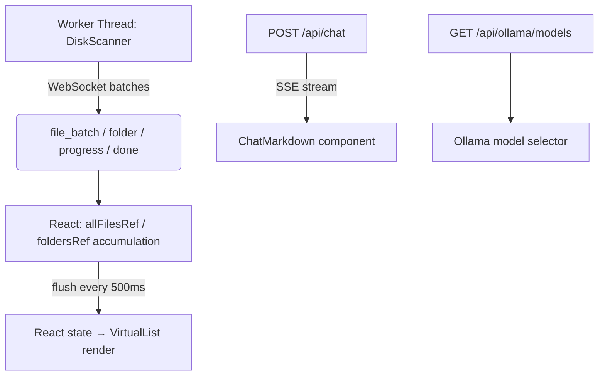
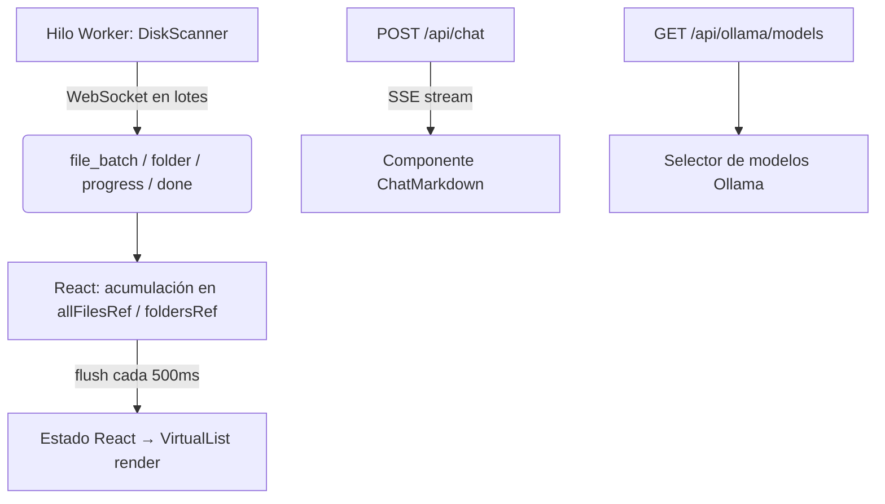

# Disk Analyzer (DKA)

[English](#english) | [Español](#español)

---

<a id="english"></a>
# Disk Analyzer (DKA) - English

[](https://www.python.org/downloads/)
[]()
[](#license)
[]()

A fast, modern disk space analyzer for Windows with an **integrated AI Assistant**. Scan your drive in seconds, visualize what is consuming your storage, and ask an AI chatbot what to do next — all from a sleek dark interface.

Two interfaces are available:

- **Classic UI** (`main.py`) — pure Python + Tkinter, no dependencies beyond the standard library.
- **Modern Web UI** (`run_modern.py`) — React + FastAPI served via pywebview. Virtualized file table, streaming chat, tabbed settings panel.

---

## Key Features

- **Fast Multithreaded Scanning:** `os.scandir()` DFS with `ThreadPoolExecutor` — real-time results streamed as it scans.
- **Modern Dark UI:** Premium dark theme inspired by Linear, Arc and Raycast — row color coding, hover animations, donut disk chart.
- **Virtualized File Table:** `react-window` renders only ~20 DOM nodes regardless of result size — handles 1M+ files smoothly.
- **Post-scan Summary Panel:** Stat cards (files, folders, total size, duplicates) + top categories breakdown after every scan.
- **Tree and Table Views:** Hierarchical folder tree and sortable file table with semantic row colors by size and type.
- **Dynamic Filtering:** Category pills, minimum size selector, and debounced real-time name search.
- **MD5 Duplicate Detection:** Finds files with the same name and size, then verifies by MD5 hash in the background.
- **Context Menu:** Right-click any file to open in Explorer, copy path, or attach to the AI chat.
- **File Management:** Send to Recycle Bin or permanently delete — with protected system path checks.
- **Excluded Folders:** Skip heavy directories from scanning (e.g. `node_modules`, `Xilinx`) — persisted across sessions.
- **Scan Logging:** Rotating log files in `logs/` for diagnosing scan issues.
- **Integrated AI Assistant:** Side chat panel with streaming responses, markdown rendering, and full access to scan metadata.

---

## AI Assistant

The right panel includes a chatbot with access to your scan results. Ask it things like:

- *"What is taking up the most space?"*
- *"Is it safe to delete these cache files?"*
- *"Which duplicates should I remove?"*
- *"Summarise what this scan found."*

Right-click any file and select **Attach to chat** to give the AI specific context about it.

### Supported Providers

| Provider | Models | Free Tier | Requires Key |
|---|---|---|---|
| **Google Gemini** | gemini-2.0-flash-lite, gemini-2.0-flash, gemini-2.5-flash/pro… | ✓ 1,500 req/day | Yes — [aistudio.google.com](https://aistudio.google.com/app/apikey) |
| **Groq** | llama-3.1-70b, llama-3.3-70b, mixtral-8x7b, deepseek-r1, qwen-qwq… | ✓ 14,400 req/day | Yes — [console.groq.com](https://console.groq.com/keys) |
| **Claude (Anthropic)** | claude-haiku-4-5, claude-sonnet-4-5/4-6, claude-opus-4-6… | Trial credits | Yes — [console.anthropic.com](https://console.anthropic.com/account/keys) |
| **Ollama (local)** | Auto-detected from your local installation | ✓ Unlimited | No — requires [Ollama](https://ollama.com) |

### LLM Parameters

- **Temperature** (0.0–2.0): controls response creativity vs. precision.
- **Max tokens** (256–4096): maximum response length.

Both are adjustable per-session from the **⚙ Params** tab in the settings panel.

### Setup

1. Open the **⚙ settings** panel in the chat header.
2. Go to the **🔑 Keys** tab — enter your API key for the desired provider.
3. Go to the **🤖 Models** tab — select a model from the list or type a custom one. For Ollama, press **↺ detect** to auto-fetch installed models.
4. Press **Verificar** to test the connection.
5. Press **Guardar** — keys are stored in `%APPDATA%\DiskAnalyzer\api_keys.json`, outside the repository.

---

## Screenshots

*(Add screenshots here)*

---

## Requirements

- **OS:** Windows 10 / 11
- **Python:** 3.11 or higher

### Python dependencies

```bash
# Core (Modern UI only):
pip install fastapi uvicorn pywebview

# AI providers (install only what you need):
pip install google-genai   # Gemini
pip install groq            # Groq
pip install anthropic       # Claude
pip install ollama          # Ollama local

# Frontend build (only needed to rebuild the UI):
cd frontend && npm install && npm run build
```

> `pywin32` is optional — improves Recycle Bin support. If absent, a `ctypes` fallback is used automatically.

---

## Installation & Running

```bash
git clone https://github.com/Lizzen/disk_analyzer.git
cd disk_analyzer

# Install Python dependencies
pip install fastapi uvicorn pywebview google-genai groq anthropic

# Modern Web UI (recommended)
python run_modern.py

# Classic Tkinter UI
python main.py
```

The Modern UI serves a pre-built React frontend from `frontend/dist/`. To rebuild it after modifying the frontend source:

```bash
cd frontend
npm install
npm run build
```

---

## Project Structure

```text
disk_analyzer/
├── main.py                    # Classic Tkinter entry point
├── run_modern.py              # Modern Web UI entry point (FastAPI + pywebview)
├── api.py                     # FastAPI backend: WebSocket scan, chat SSE, config
├── app.py                     # Classic UI orchestrator: polling loop, dispatcher
├── core/
│   ├── models.py              # Data classes: FileEntry, FolderNode, ScanResult
│   ├── scanner.py             # DFS scanner + MD5 duplicate verification
│   └── trash.py               # Recycle Bin, safe permanent delete, open in Explorer
├── ui/                        # Classic Tkinter UI components
│   ├── theme.py               # Centralized dark palette, ttk styles, color helpers
│   ├── toolbar.py             # Top bar: logo, path entry, buttons
│   ├── disk_bar.py            # Animated donut chart + disk usage metrics
│   ├── tree_panel.py          # Folder tree with hover and context menu
│   ├── file_table.py          # Sortable file table, row color tags, hover
│   ├── filter_bar.py          # Category pills, size combobox, name search
│   ├── summary_panel.py       # Post-scan stat cards and category bar chart
│   ├── status_bar.py          # Progress bar, status dot, inline metrics
│   ├── tooltip.py             # Floating tooltip with delay and auto-hide
│   ├── dialogs.py             # Confirm delete and duplicates dialogs
│   └── exclude_dialog.py      # Scan exclusion list manager
├── chatbot/
│   ├── config.py              # API key storage (AppData) and model config
│   ├── context_builder.py     # Builds system prompt from scan metadata
│   └── providers/
│       ├── base.py            # Abstract AIProvider base class
│       ├── gemini.py          # Google Gemini (google-genai)
│       ├── groq_p.py          # Groq (groq)
│       ├── claude.py          # Anthropic Claude (anthropic)
│       └── ollama.py          # Ollama local (ollama) — lists installed models
├── frontend/                  # Modern React UI
│   ├── src/App.jsx            # Main component (~1400 lines)
│   ├── dist/                  # Pre-built production assets served by pywebview
│   └── package.json
├── utils/
│   ├── formatters.py          # Byte and percentage formatting
│   └── logger.py              # Rotating file logger (logs/dka_YYYY-MM-DD.log)
├── tests/
│   └── test_scanner.py        # Unit tests for scanner and models
└── logs/                      # Auto-created scan log files
```

---

## Architecture

### Modern UI — Real-Time Scanning

The scanner runs in a background thread and sends batched messages to the frontend via WebSocket. The React frontend accumulates results in refs (no re-render per batch) and flushes to state every 500ms.



### WebSocket Message Types

| Type | Fields |
|---|---|
| `start` | `root` |
| `folder` | `path`, `size`, `file_count` |
| `file_batch` | `entries: list[dict]` |
| `progress` | `done`, `total`, `current`, `bytes` |
| `done` | `total_bytes`, `elapsed`, `duplicates`, `errors` |

### API Endpoints

| Method | Path | Description |
|---|---|---|
| `WS` | `/ws/scan` | Real-time scan messages |
| `GET` | `/api/disk-info` | Disk usage for a given path |
| `POST` | `/api/chat` | SSE streaming AI chat |
| `GET` | `/api/config` | Load saved config (keys masked) |
| `POST` | `/api/config` | Save API keys and model names |
| `GET` | `/api/providers/status` | Verify all provider connections |
| `GET` | `/api/ollama/models` | List locally installed Ollama models |
| `POST` | `/api/open-in-explorer` | Open a path in Windows Explorer |

---

## Table Color Code

| Color | Meaning |
|---|---|
| Red row | > 1 GB |
| Amber row | > 100 MB |
| Blue row | > 10 MB |
| Purple row | Cache / temporary file |
| Alternating dark | All other files |

---

## Detected File Categories

| Category | Extensions |
|---|---|
| Videos | `.mp4`, `.mkv`, `.avi`, `.mov`, `.wmv`, `.ts`… |
| Images | `.jpg`, `.png`, `.gif`, `.raw`, `.psd`, `.heic`… |
| Audio | `.mp3`, `.flac`, `.wav`, `.aac`, `.opus`… |
| Documents | `.pdf`, `.docx`, `.xlsx`, `.txt`, `.epub`… |
| Installers/ISO | `.iso`, `.exe`, `.msi`, `.zip`, `.7z`, `.rar`… |
| Temporary/Cache | `.tmp`, `.temp`, `.log`, `.bak`, `.dmp`… |
| Dev (compiled) | `.pyc`, `.class`, `.obj`, `.pdb`… |
| Databases | `.db`, `.sqlite`, `.mdf`… |

---

## Security & Privacy

- **Protected permanent deletion:** Rejects critical system paths (`C:\`, `C:\Windows`, `C:\System32`, etc.).
- **No `shell=True`:** Subprocesses use argument lists — no command injection risk.
- **AI sees metadata only:** The chatbot receives names, sizes, paths and categories. It never reads file contents.
- **API keys stored safely:** Saved in `%APPDATA%\DiskAnalyzer\api_keys.json`, outside the repository — never committed to git.
- **Daemon threads:** Scanner and MD5 verifier use `daemon=True` — process exits cleanly.
- **Recycle by default:** Permanent deletion requires an additional explicit confirmation.

---

## License

**Free and Non-Commercial License.**

- **Allowed:** Use, view, modify, and share improvements freely.
- **Forbidden:** Sell, charge for distribution, or integrate into commercial products.
- **Required:** Keep the copyright notice (`Copyright (c) Lizzen`) on any distributed or modified version.

See the `LICENSE` file for full terms.

---
---

<a id="español"></a>
# Disk Analyzer (DKA) - Español

[](https://www.python.org/downloads/)
[]()
[](#licencia)
[]()

Analizador de espacio en disco moderno para Windows con **Asistente de IA integrado**. Escanea tu disco en segundos, visualiza qué consume tu almacenamiento y pregunta al chatbot qué hacer — todo desde una interfaz oscura y fluida.

Dos interfaces disponibles:

- **Interfaz Clásica** (`main.py`) — Python puro + Tkinter, sin dependencias externas.
- **Interfaz Web Moderna** (`run_modern.py`) — React + FastAPI servido vía pywebview. Tabla virtualizada, chat con streaming, panel de ajustes con pestañas.

---

## Características Principales

- **Escaneo Multihilo Rápido:** DFS con `os.scandir()` y `ThreadPoolExecutor` — resultados en tiempo real mientras escanea.
- **Interfaz Oscura Moderna:** Tema premium inspirado en Linear, Arc y Raycast — código de colores por tamaño, animaciones hover, gráfico donut del disco.
- **Tabla Virtualizada:** `react-window` renderiza solo ~20 nodos DOM sin importar el tamaño — fluido con más de 1M de archivos.
- **Panel de Resumen Post-Escaneo:** Tarjetas de estadísticas (archivos, carpetas, tamaño total, duplicados) + desglose de categorías.
- **Árbol y Tabla:** Vista jerárquica de carpetas y tabla de archivos ordenable con colores semánticos por tamaño y tipo.
- **Filtrado Dinámico:** Pills de categoría, selector de tamaño mínimo y búsqueda por nombre con debounce.
- **Detección de Duplicados con MD5:** Encuentra archivos con mismo nombre y tamaño, luego verifica en segundo plano.
- **Menú Contextual:** Clic derecho en cualquier archivo para abrir en Explorador, copiar ruta o adjuntar al chat de IA.
- **Gestión de Archivos:** Mover a Papelera o eliminar permanentemente — con protección de rutas del sistema.
- **Carpetas Excluidas:** Omite directorios pesados del escaneo — se persisten entre sesiones.
- **Asistente IA Integrado:** Panel de chat con respuestas en streaming, renderizado Markdown y acceso completo a los metadatos del escaneo.

---

## Asistente IA

El panel derecho incluye un chatbot con acceso a los resultados de tu escaneo. Puedes preguntarle:

- *"¿Qué está ocupando más espacio?"*
- *"¿Puedo borrar los archivos de caché de forma segura?"*
- *"¿Cuáles de estos duplicados debo eliminar?"*
- *"Resume lo que encontró este escaneo."*

Haz clic derecho en cualquier archivo y selecciona **Adjuntar al chat** para darle contexto específico a la IA.

### Proveedores Soportados

| Proveedor | Modelos | Tier gratuito | Requiere key |
|---|---|---|---|
| **Google Gemini** | gemini-2.0-flash-lite, gemini-2.0-flash, gemini-2.5-flash/pro… | ✓ 1.500 req/día | Sí — [aistudio.google.com](https://aistudio.google.com/app/apikey) |
| **Groq** | llama-3.1-70b, llama-3.3-70b, mixtral-8x7b, deepseek-r1, qwen-qwq… | ✓ 14.400 req/día | Sí — [console.groq.com](https://console.groq.com/keys) |
| **Claude (Anthropic)** | claude-haiku-4-5, claude-sonnet-4-5/4-6, claude-opus-4-6… | Créditos trial | Sí — [console.anthropic.com](https://console.anthropic.com/account/keys) |
| **Ollama (local)** | Detectado automáticamente desde tu instalación local | ✓ Sin límite | No — requiere [Ollama](https://ollama.com) |

### Parámetros del LLM

- **Temperatura** (0.0–2.0): controla creatividad vs. precisión.
- **Máx. tokens** (256–4096): longitud máxima de respuesta.

Ambos ajustables en la pestaña **⚙ Params** del panel de configuración.

### Configurar la IA

1. Abre el panel **⚙ configuración** en la cabecera del chat.
2. Pestaña **🔑 Keys** — introduce tu API key del proveedor deseado.
3. Pestaña **🤖 Modelos** — selecciona un modelo de la lista o escribe uno personalizado. Para Ollama, pulsa **↺ detectar** para cargar los modelos instalados.
4. Pulsa **Verificar** para comprobar la conexión.
5. Pulsa **Guardar** — se guarda en `%APPDATA%\DiskAnalyzer\api_keys.json`, fuera del repositorio.

---

## Capturas de Pantalla

*(Añade aquí capturas de la aplicación)*

---

## Requisitos

- **Sistema Operativo:** Windows 10 / 11
- **Python:** 3.11 o superior

### Dependencias Python

```bash
# Interfaz moderna (obligatorio):
pip install fastapi uvicorn pywebview

# Proveedores de IA (instala solo los que necesites):
pip install google-genai   # Gemini
pip install groq            # Groq
pip install anthropic       # Claude
pip install ollama          # Ollama local

# Reconstruir el frontend (solo si modificas el código React):
cd frontend && npm install && npm run build
```

> `pywin32` es opcional — mejora el soporte de la Papelera. Si no está instalado se usa un fallback automático vía `ctypes`.

---

## Instalación y Ejecución

```bash
git clone https://github.com/Lizzen/disk_analyzer.git
cd disk_analyzer

# Instalar dependencias Python
pip install fastapi uvicorn pywebview google-genai groq anthropic

# Interfaz Web Moderna (recomendada)
python run_modern.py

# Interfaz Clásica Tkinter
python main.py
```

La interfaz moderna sirve el frontend React pre-compilado desde `frontend/dist/`. Para recompilarlo tras modificar el código fuente del frontend:

```bash
cd frontend
npm install
npm run build
```

---

## Estructura del Proyecto

```text
disk_analyzer/
├── main.py                    # Punto de entrada — Interfaz Clásica Tkinter
├── run_modern.py              # Punto de entrada — Interfaz Web Moderna
├── api.py                     # Backend FastAPI: WebSocket scan, chat SSE, config
├── app.py                     # Orquestador UI clásica: polling loop, dispatcher
├── core/
│   ├── models.py              # Clases de datos: FileEntry, FolderNode, ScanResult
│   ├── scanner.py             # Scanner DFS + verificación de duplicados por MD5
│   └── trash.py               # Papelera, borrado permanente, abrir en Explorador
├── ui/                        # Componentes de la UI Clásica (Tkinter)
│   ├── theme.py               # Paleta oscura, estilos ttk y helpers de color
│   ├── toolbar.py             # Barra superior: logo, entry de ruta, botones
│   ├── disk_bar.py            # Gráfico donut animado + métricas de disco
│   ├── tree_panel.py          # Árbol de carpetas con hover y menú contextual
│   ├── file_table.py          # Tabla de archivos ordenable con hover y tags de color
│   ├── filter_bar.py          # Pills de categoría, selector de tamaño, búsqueda
│   ├── summary_panel.py       # Panel post-escaneo: tarjetas y barras de categorías
│   ├── status_bar.py          # Barra de progreso, dot de estado, métricas inline
│   ├── tooltip.py             # Tooltip flotante con delay y auto-hide
│   ├── dialogs.py             # Diálogos de confirmación de borrado y duplicados
│   └── exclude_dialog.py      # Gestión de carpetas excluidas del escaneo
├── chatbot/
│   ├── config.py              # Almacenamiento de API keys (AppData) y config de modelos
│   ├── context_builder.py     # Construye el system prompt con metadatos del escaneo
│   └── providers/
│       ├── base.py            # Clase abstracta AIProvider
│       ├── gemini.py          # Google Gemini (google-genai)
│       ├── groq_p.py          # Groq (groq)
│       ├── claude.py          # Anthropic Claude (anthropic)
│       └── ollama.py          # Ollama local — lista modelos instalados automáticamente
├── frontend/                  # Interfaz Web Moderna (React + Vite)
│   ├── src/App.jsx            # Componente principal (~1400 líneas)
│   ├── dist/                  # Assets de producción pre-compilados
│   └── package.json
├── utils/
│   ├── formatters.py          # Formateo de bytes y porcentajes
│   └── logger.py              # Logger rotativo (logs/dka_YYYY-MM-DD.log)
├── tests/
│   └── test_scanner.py        # Tests unitarios del scanner y los modelos
└── logs/                      # Archivos de log generados automáticamente
```

---

## Arquitectura

### Interfaz Moderna — Escaneo en Tiempo Real

El scanner corre en un hilo separado y envía lotes de mensajes al frontend vía WebSocket. React acumula los resultados en refs (sin re-render por lote) y vuelca al estado cada 500ms.



### Tipos de Mensajes WebSocket

| Tipo | Campos |
|---|---|
| `start` | `root` |
| `folder` | `path`, `size`, `file_count` |
| `file_batch` | `entries: list[dict]` |
| `progress` | `done`, `total`, `current`, `bytes` |
| `done` | `total_bytes`, `elapsed`, `duplicates`, `errors` |

### Endpoints de la API

| Método | Ruta | Descripción |
|---|---|---|
| `WS` | `/ws/scan` | Mensajes de escaneo en tiempo real |
| `GET` | `/api/disk-info` | Uso de disco para una ruta dada |
| `POST` | `/api/chat` | Chat con IA vía SSE streaming |
| `GET` | `/api/config` | Carga configuración guardada (keys enmascaradas) |
| `POST` | `/api/config` | Guarda API keys y nombres de modelos |
| `GET` | `/api/providers/status` | Verifica la conexión de todos los proveedores |
| `GET` | `/api/ollama/models` | Lista los modelos Ollama instalados localmente |
| `POST` | `/api/open-in-explorer` | Abre una ruta en el Explorador de Windows |

---

## Código de Colores en la Tabla

| Color | Significado |
|---|---|
| Rojo | > 1 GB |
| Naranja | > 100 MB |
| Azul | > 10 MB |
| Morado | Archivo de caché / temporal |
| Alternado oscuro | Resto de archivos |

---

## Categorías de Archivos Detectadas

| Categoría | Extensiones |
|---|---|
| Videos | `.mp4`, `.mkv`, `.avi`, `.mov`, `.wmv`, `.ts`… |
| Imágenes | `.jpg`, `.png`, `.gif`, `.raw`, `.psd`, `.heic`… |
| Audio | `.mp3`, `.flac`, `.wav`, `.aac`, `.opus`… |
| Documentos | `.pdf`, `.docx`, `.xlsx`, `.txt`, `.epub`… |
| Instaladores/ISO | `.iso`, `.exe`, `.msi`, `.zip`, `.7z`, `.rar`… |
| Temporales/Cache | `.tmp`, `.temp`, `.log`, `.bak`, `.dmp`… |
| Desarrollo (compilados) | `.pyc`, `.class`, `.obj`, `.pdb`… |
| Bases de datos | `.db`, `.sqlite`, `.mdf`… |

---

## Seguridad y Privacidad

- **Borrado permanente protegido:** Rechaza rutas críticas del sistema (`C:\`, `C:\Windows`, `C:\System32`, etc.).
- **Sin `shell=True`:** Los subprocesos usan listas de argumentos — sin riesgo de inyección de comandos.
- **La IA solo ve metadatos:** El chatbot recibe nombres, tamaños, rutas y categorías. Nunca el contenido de los archivos.
- **API keys fuera del código:** Se guardan en `%APPDATA%\DiskAnalyzer\api_keys.json`, fuera del repositorio — nunca se suben a git.
- **Hilos daemon:** El scanner y el verificador MD5 usan `daemon=True` — el proceso termina limpiamente.
- **Mover a Papelera por defecto:** El borrado permanente requiere un diálogo de confirmación adicional.

---

## Contribuir

1. Haz un *Fork* del repositorio.
2. Crea una rama: `git checkout -b feature/NuevaCaracteristica`
3. Haz commit: `git commit -m 'Añade NuevaCaracteristica'`
4. Push: `git push origin feature/NuevaCaracteristica`
5. Abre un **Pull Request**.

---

## Licencia

Licencia **Gratuita y No Comercial.**

- **Permitido:** Usar, ver, modificar y compartir mejoras libremente.
- **Prohibido:** Vender, cobrar por la distribución o integrar en productos comerciales.
- **Obligatorio:** Mantener el aviso de copyright (`Copyright (c) Lizzen`) en cualquier versión distribuida o modificada.

Consulta el archivo `LICENSE` para los términos completos.
