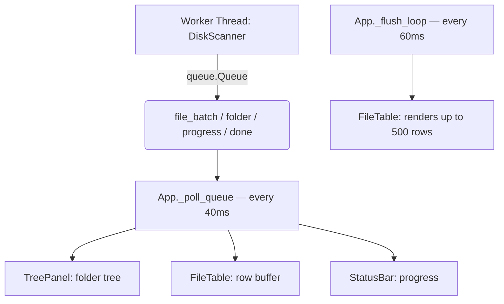
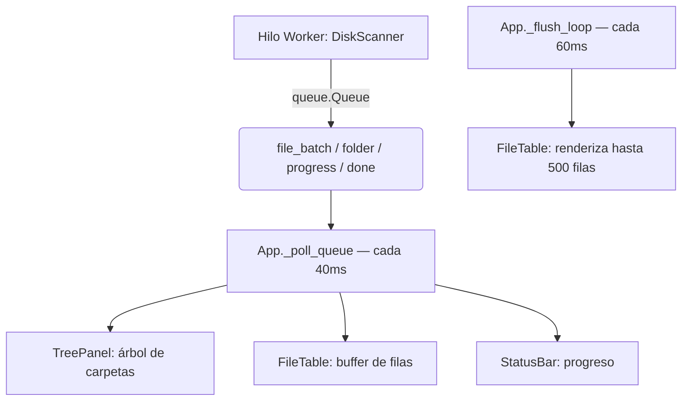

# Disk Analyzer (DKA)

[English](#english) | [Español](#español)

---

<a id="english"></a>
# Disk Analyzer (DKA) - English

[](https://www.python.org/downloads/)
[](#license)
[]()

A fast and lightweight disk space analyzer GUI for Windows, featuring an **integrated AI Assistant**. Built entirely with Python and `tkinter`, it lets you quickly discover which files and folders are consuming your storage and ask an AI what to do with them.

---

## Key Features

- **Fast Multithreaded Scanning:** Uses `ThreadPoolExecutor` to scan directories in parallel with real-time results.
- **Tree and Table Views:** Hierarchical folder view and detailed, sortable file table.
- **Dynamic Filtering:** Filter by file type, minimum size, and name (real-time search).
- **File Management:** Send to Recycle Bin or permanently delete with confirmation dialogs.
- **Duplicate Detection:** Find files with the exact same name and size (>1 MB) from `View → Show duplicates`.
- **Excluded Folders:** Exclude heavy folders from the scan (e.g., `Xilinx`, `node_modules`) from `File → Excluded folders…`. Rules are remembered across sessions.
- **Integrated AI Assistant:** A side chat panel supporting 4 AI providers. It has access to scan metadata (names, sizes, paths, categories) but **never** to the file contents.

---

## AI Assistant

The right panel of the application includes a chatbot that can answer questions like:
- *"What is this file for?"*
- *"Which folder is taking up the most space?"*
- *"Is it safe to delete these cache files?"*
- *"What are these duplicate files?"*

### Supported Providers

| Provider | Default Model | Free Tier | Requires Key |
|-----------|-------------------|---------------|--------------|
| **Google Gemini** | gemini-2.0-flash-lite | ✓ 1,500 req/day | Yes — [aistudio.google.com](https://aistudio.google.com/app/apikey) |
| **Groq** | llama-3.3-70b-versatile | ✓ 14,400 req/day | Yes — [console.groq.com](https://console.groq.com/keys) |
| **Claude (Anthropic)** | claude-haiku-4-5 | Trial credits | Yes — [console.anthropic.com](https://console.anthropic.com/account/keys) |
| **Ollama (local)** | llama3.2 | ✓ Unlimited | No — requires [Ollama](https://ollama.com) installed |

### AI Configuration

1. Open `AI Chat → API Settings…`
2. Enter your API key for the desired provider
3. Select the model from the dropdown (or hit **↺** to fetch available models from the API)
4. Click **Test connection
4. Click **Verify Connection** to test it
5. Click **Save** — settings are securely saved in `%APPDATA%\DiskAnalyzer\api_keys.json`

---

## Screenshots

*(Add screenshots of your application running here)*

---

## Requirements

- **Operating System:** Windows 10 / 11
- **Python:** 3.10 or higher

### Dependencies

Install the AI assistant dependencies according to the provider you want to use:

```bash
# All cloud providers at once:
pip install google-genai groq anthropic

# Only Ollama (local, works offline):
pip install ollama
```

> `pywin32` is optional: it improves Recycle Bin support natively. If not installed, an automatic fallback via `ctypes` takes over.

---

## Installation and Usage

1. Clone the repository:
   ```bash
   git clone https://github.com/Lizzen/disk_analyzer.git
   cd disk_analyzer
   ```

2. (Optional) Install chatbot dependencies:
   ```bash
   pip install google-genai groq anthropic
   ```

3. Run the application:
   ```bash
   python main.py
   ```

---

## Real-Time Scanning Architecture

The scanner runs in a separate thread and communicates with the UI via a `queue.Queue` to prevent freezing.



### Scanner Message Types

| Type | Fields |
|------|--------|
| `start` | `root`, `n_top` |
| `folder` | `path`, `parent`, `size`, `file_count` |
| `file_batch` | `entries: list[dict]` |
| `progress` | `done`, `total`, `current`, `bytes` |
| `done` | `total_bytes`, `elapsed`, `duplicates` |
| `error` | `path`, `msg` |

---

## Keyboard Shortcuts

| Action | Shortcut |
|--------|-------|
| New Scan | `F5` |
| Move to Recycle Bin | `Del` (Delete) |
| Copy Path | `Ctrl+C` |
| Open in Explorer | Double Click |
| Permanent Delete | Right Click → Context Menu |

---

## Table Color Code

| Color | Meaning |
|-------|-------------|
| Red | > 1 GB |
| Orange | > 100 MB |
| Yellow | > 10 MB |
| Blue-grey | Cache / Temporary file |

---

## Security & Privacy 

- **Protected Permanent Deletion:** Automatically rejects critical system paths (`C:\`, `C:\Windows`, `C:\System32`, etc.).
- **No `shell=True`:** Subprocesses use argument lists, preventing malicious command injection.
- **AI ONLY sees metadata:** The chatbot receives file names, sizes, paths and categories. It **never reads file contents**.
- **API keys stored safely:** Stored in `%APPDATA%\DiskAnalyzer\api_keys.json`, strictly outside the repository.
- **Daemon threads:** The scanner uses `daemon=True` so the process terminates completely on exit.
- **Recycle by default:** Permanent deletion requires an additional explicit confirmation.

---

## License

**Free and Non-Commercial License**.

- **Allowed:** Freely use, view the code, edit, and share your improvements.
- **Forbidden:** Sell, distribute for a fee, or integrate into commercial products.
- **Mandatory:** You must keep the copyright notice (`Copyright (c) Lizzen`) on any distributed or modified version.

Check the `LICENSE` file for the full terms.

---
---

<a id="español"></a>
# Disk Analyzer (DKA) - Español

[](https://www.python.org/downloads/)
[](#licencia)
[]()

Un analizador de espacio en disco con interfaz gráfica (GUI) rápido y ligero para Windows, con **Asistente de IA integrado**. Construido íntegramente con Python y `tkinter`, te permite descubrir rápidamente qué archivos y carpetas están consumiendo el almacenamiento de tu disco y preguntarle a una IA qué hacer con ellos.

---

## Características Principales

- **Escaneo Multihilo Rápido:** Usa `ThreadPoolExecutor` para escanear directorios en paralelo con resultados en tiempo real.
- **Visualización en Árbol y Tabla:** Vista jerárquica de carpetas y tabla detallada de archivos ordenable.
- **Filtrado Dinámico:** Filtra por tipo, tamaño mínimo y nombre (búsqueda en tiempo real).
- **Gestión de Archivos:** Envía a la Papelera o elimina permanentemente con confirmación.
- **Detección de Duplicados:** Encuentra archivos con mismo nombre y tamaño (>1 MB) desde `Ver → Mostrar duplicados`.
- **Carpetas Excluidas:** Excluye carpetas pesadas del escaneo (ej. `Xilinx`, `node_modules`) desde `Archivo → Carpetas excluidas…`. Se persisten entre sesiones.
- **Asistente IA integrado:** Panel de chat lateral con soporte para 4 proveedores de IA. Tiene acceso a los metadatos del escaneo (nombres, tamaños, rutas, categorías) pero **nunca** al contenido de los archivos.

---

## Asistente IA

El panel derecho de la aplicación incluye un chatbot que puede responder preguntas como:
- *"¿Para qué sirve este archivo?"*
- *"¿Qué carpeta ocupa más espacio?"*
- *"¿Puedo eliminar los archivos de caché de forma segura?"*
- *"¿Qué son estos duplicados?"*

### Proveedores soportados

| Proveedor | Modelo por defecto | Tier gratuito | Requiere key |
|-----------|-------------------|---------------|--------------|
| **Google Gemini** | gemini-2.0-flash-lite | ✓ 1.500 req/día | Sí — [aistudio.google.com](https://aistudio.google.com/app/apikey) |
| **Groq** | llama-3.3-70b-versatile | ✓ 14.400 req/día | Sí — [console.groq.com](https://console.groq.com/keys) |
| **Claude (Anthropic)** | claude-haiku-4-5 | Créditos trial | Sí — [console.anthropic.com](https://console.anthropic.com/account/keys) |
| **Ollama (local)** | llama3.2 | ✓ Sin límite | No — requiere [Ollama](https://ollama.com) instalado |

### Configurar la IA

1. Abre `Chat IA → Configurar APIs…`
2. Introduce tu API key en el proveedor deseado
3. Selecciona el modelo con el desplegable (o pulsa **↺** para cargar los modelos disponibles desde la API)
4. Pulsa **Verificar conexión** para comprobar que funciona
5. Pulsa **Guardar** — la configuración se persiste en `%APPDATA%\DiskAnalyzer\api_keys.json`

---

## Capturas de Pantalla

*(Añade aquí capturas de pantalla de la aplicación funcionando)*

---

## Requisitos

- **Sistema Operativo:** Windows 10 / 11
- **Python:** 3.10 o superior

### Dependencias

Instala las dependencias del asistente IA según el proveedor que quieras usar:

```bash
# Todos los proveedores de nube de una vez:
pip install google-genai groq anthropic

# Solo Ollama (local, sin internet):
pip install ollama
```

> `pywin32` es opcional: mejora el soporte de la Papelera de Reciclaje. Si no está instalado se usa un fallback automático vía `ctypes`.

---

## Instalación y Uso

1. Clona el repositorio:
   ```bash
   git clone https://github.com/Lizzen/disk_analyzer.git
   cd disk_analyzer
   ```

2. (Opcional) Instala dependencias del chatbot:
   ```bash
   pip install google-genai groq anthropic
   ```

3. Ejecuta la aplicación:
   ```bash
   python main.py
   ```

---

## Estructura del Proyecto

```text
disk_analyzer/
├── main.py                   # Punto de entrada
├── app.py                    # Orquestador principal (polling loop, dispatcher)
├── core/
│   ├── models.py             # Clases de datos: FileEntry, FolderNode, ScanResult
│   ├── scanner.py            # Motor de escaneo paralelo con soporte de exclusiones
│   └── trash.py              # Papelera y borrado seguro
├── ui/
│   ├── toolbar.py            # Barra superior (ruta + botones)
│   ├── disk_bar.py           # Barra visual de uso de disco
│   ├── tree_panel.py         # Panel árbol de carpetas
│   ├── file_table.py         # Tabla de archivos con batch rendering
│   ├── filter_bar.py         # Filtros (tipo, tamaño, nombre)
│   ├── status_bar.py         # Barra inferior con métricas y progreso
│   ├── dialogs.py            # Diálogos: confirmación borrado, duplicados
│   ├── exclude_dialog.py     # Gestión de carpetas excluidas del escaneo
│   └── theme.py              # Paleta de colores y estilos ttk centralizados
├── chatbot/
│   ├── config.py             # API keys, modelos y configuración (persiste en AppData)
│   ├── context_builder.py    # Construye el system prompt con metadatos del escaneo
│   ├── providers/
│   │   ├── base.py           # Clase abstracta AIProvider
│   │   ├── gemini.py         # Proveedor Google Gemini (google-genai)
│   │   ├── groq_p.py         # Proveedor Groq (groq)
│   │   ├── claude.py         # Proveedor Anthropic Claude (anthropic)
│   │   └── ollama.py         # Proveedor Ollama local (ollama)
│   └── ui/
│       ├── chat_panel.py     # Panel de chat con streaming y selector de proveedor
│       └── settings_dialog.py# Diálogo de configuración de APIs y modelos
└── utils/
    └── formatters.py         # Formateo de bytes y porcentajes
```

---

## Arquitectura de Escaneo en Tiempo Real

El scanner corre en un hilo separado y se comunica con la UI mediante una `queue.Queue`:



### Tipos de mensajes del scanner

| Tipo | Campos |
|------|--------|
| `start` | `root`, `n_top` |
| `folder` | `path`, `parent`, `size`, `file_count` |
| `file_batch` | `entries: list[dict]` |
| `progress` | `done`, `total`, `current`, `bytes` |
| `done` | `total_bytes`, `elapsed`, `duplicates` |
| `error` | `path`, `msg` |

---

## Accesos Directos

| Acción | Atajo |
|--------|-------|
| Nuevo escaneo | `F5` |
| Mover a Papelera | `Supr` (Delete) |
| Copiar ruta | `Ctrl+C` |
| Abrir en Explorador | Doble clic en archivo |
| Eliminar permanente | Clic derecho → menú contextual |

---

## Código de colores en la tabla

| Color | Significado |
|-------|-------------|
| Rojo | > 1 GB |
| Naranja | > 100 MB |
| Amarillo | > 10 MB |
| Gris azulado | Archivo de caché / temporal |

---

## Categorías de archivos detectadas

| Categoría | Extensiones |
|-----------|-------------|
| Videos | .mp4, .mkv, .avi, .mov, .wmv, .ts… |
| Imágenes | .jpg, .png, .gif, .raw, .psd, .heic… |
| Audio | .mp3, .flac, .wav, .aac, .opus… |
| Documentos | .pdf, .docx, .xlsx, .txt, .epub… |
| Instaladores/ISO | .iso, .exe, .msi, .zip, .7z, .rar… |
| Temporales/Cache | .tmp, .temp, .log, .bak, .dmp… |
| Desarrollo (compilados) | .pyc, .class, .obj, .pdb… |
| Bases de datos | .db, .sqlite, .mdf… |

---

## Seguridad

- **Borrado permanente protegido:** Rechaza rutas críticas del sistema (`C:\`, `C:\Windows`, `C:\System32`, etc.).
- **Sin `shell=True`:** Los subprocesos usan listas de argumentos, previniendo inyección de comandos.
- **La IA solo ve metadatos:** El chatbot recibe nombres, tamaños, rutas y categorías. Nunca el contenido de los archivos.
- **API keys fuera del código:** Las claves se guardan en `%APPDATA%\DiskAnalyzer\api_keys.json`, no en el repositorio.
- **Hilos daemon:** El scanner usa `daemon=True` para que el proceso termine correctamente al cerrar la ventana.
- **Mover a Papelera por defecto:** El borrado permanente requiere confirmación explícita adicional.

---

## Contribuir

1. Haz un *Fork* del repositorio.
2. Crea una rama: `git checkout -b feature/NuevaCaracteristica`
3. Haz commit: `git commit -m 'Añade NuevaCaracteristica'`
4. Push: `git push origin feature/NuevaCaracteristica`
5. Abre un **Pull Request**.

---

## Licencia

Licencia **Gratuita y No Comercial**.

- **Permitido:** Usar libremente, ver, editar y compartir mejoras.
- **Prohibido:** Vender, distribuir cobrando, integrar en productos comerciales.
- **Obligatorio:** Mantener el aviso de copyright (`Copyright (c) Lizzen`) en cualquier versión distribuida.

Consulta el archivo `LICENSE` para los términos completos.
